# 🔍 Automated Architecture Discovery System

[](https://opensource.org/licenses/MIT)
[](https://www.python.org/downloads/)
[]()

> **⚠️ IMPORTANT DISCLAIMER**: This is a demonstration project created for educational and portfolio purposes. It is **NOT production-ready** and should **NOT** be deployed to production environments without significant modifications, security hardening, and thorough testing. See [DISCLAIMER.md](DISCLAIMER.md) for full details.

## 📋 Table of Contents

- [Overview](#overview)
- [Features](#features)
- [Architecture](#architecture)
- [Quick Start](#quick-start)
- [Documentation](#documentation)
- [Cost Analysis](#cost-analysis)
- [Roadmap](#roadmap)
- [Contributing](#contributing)
- [License](#license)
- [Disclaimer](#disclaimer)

## 🎯 Overview

An AI-powered system that automatically discovers, documents, and tracks your microservices architecture by tracing real user flows through your applications. Built with Python and Claude AI, this system generates comprehensive architecture diagrams, detects architectural drift, and maintains a complete audit trail—all automatically.

### The Problem It Solves

- 📚 **Outdated Documentation**: Manual architecture docs become stale within weeks
- 🕵️ **Unknown Dependencies**: Hidden service relationships causing production issues
- 📊 **Compliance Audits**: Time-consuming manual documentation for SOC2/ISO audits
- 🆕 **Developer Onboarding**: Steep learning curve understanding complex systems
- 🔄 **Architecture Drift**: Undetected changes accumulating over time

### The Solution

This system automatically:
1. **Traces** user journeys through your application using correlation IDs
2. **Validates** flows against log aggregation systems (Splunk)
3. **Analyzes** architecture using AI (Claude API)
4. **Generates** comprehensive Mermaid diagrams
5. **Detects** drift by comparing against historical baselines
6. **Documents** everything with zero manual intervention

## ✨ Features

### Core Capabilities

- ✅ **Automatic Service Discovery**: Identifies all microservices from actual traffic
- ✅ **Dependency Mapping**: Maps all service-to-service relationships with call frequencies
- ✅ **API Catalog Generation**: Documents all endpoints with HTTP methods and response codes
- ✅ **User Journey Tracing**: Follows complete request flows across multiple services
- ✅ **Drift Detection**: Compares current state against historical baselines
- ✅ **AI-Powered Analysis**: Leverages Claude AI for intelligent insights
- ✅ **Visual Diagrams**: Auto-generates Mermaid architecture and sequence diagrams
- ✅ **Cost-Effective**: Runs on a single AWS t3.medium instance (~$33/month)

### What You Get

1. **Complete Architecture Diagram** - All services, dependencies, and endpoints
2. **Dependency Matrix** - Visual table showing all service relationships
3. **API Catalog** - Complete list of all discovered endpoints
4. **Sequence Diagrams** - Detailed flow diagrams for each user journey
5. **Drift Reports** - Historical comparison with severity scoring
6. **Audit Trail** - Complete history of architectural changes

## 🏗️ Architecture

```mermaid
graph TB
    User[👤 User Journey Simulator]
    MS[🔷 Microservices]
    Splunk[📊 Splunk Log Collector]
    Tracer[🤖 AI Architecture Tracer]
    Claude[🧠 Claude AI API]
    Drift[📈 Drift Detector]
    Diagrams[🎨 Diagram Generator]
    Output[📄 Documentation]
    
    User -->|HTTP Requests| MS
    MS -->|Structured Logs| Splunk
    User -->|Trace Data| Tracer
    Splunk -->|Validation| Tracer
    Tracer -->|Analysis Request| Claude
    Claude -->|Insights| Tracer
    Tracer -->|Discovered Arch| Diagrams
    Tracer -->|Current State| Drift
    Drift -->|Historical Comparison| Output
    Diagrams -->|Markdown Docs| Output
```



### System Components

**Microservices (6 services)**:
- `auth_service` - User authentication
- `product_service` - Product catalog
- `order_service` - Order management
- `payment_service` - Payment processing
- `loyalty_service` - Loyalty program
- `policy_service` - Policy documents

**Discovery Pipeline**:
1. `user_journey_simulator.py` - Simulates 5 different user personas
2. `splunk_logger.py` - Collects and aggregates logs
3. `architecture_tracer.py` - AI-powered architecture discovery
4. `enhanced_diagram_generator.py` - Creates visual documentation
5. `advanced_drift_tracker.py` - Tracks changes over time
6. `master_orchestrator.py` - One-click execution

## 🚀 Quick Start

### Prerequisites

- Python 3.8 or higher
- Anthropic API key (Claude)
- 2GB RAM minimum
- Linux/Mac/Windows with WSL

### Installation

```bash
# 1. Clone the repository
git clone https://github.com/YOUR_USERNAME/automated-architecture-discovery.git
cd automated-architecture-discovery

# 2. Create virtual environment
python3 -m venv venv
source venv/bin/activate  # On Windows: venv\Scripts\activate

# 3. Install dependencies
pip install -r requirements.txt

# 4. Set up environment variables
export ANTHROPIC_API_KEY="your-api-key-here"

# 5. Run the complete discovery system
python master_orchestrator.py
```

### Expected Output

After ~2 minutes, you'll have:
- ✅ `complete_annotated_architecture.md` - Full architecture documentation
- ✅ `discovered_architecture.json` - Raw discovered architecture
- ✅ `architecture_history/` - Historical snapshots and drift reports
- ✅ `logs/` - Execution logs

### Viewing Results

```bash
# View the complete architecture
cat complete_annotated_architecture.md

# Or open in VS Code with Mermaid preview
code complete_annotated_architecture.md
# Press Ctrl+K V to see diagrams rendered
```
## 📚 Documentation

- **[Getting Started](docs/GETTING_STARTED.md)** - Installation and setup guide
- **[Architecture](docs/ARCHITECTURE.md)** - System design and components
- **[Troubleshooting](docs/TROUBLESHOOTING.md)** - Common issues and solutions
- **[Contributing](CONTRIBUTING.md)** - How to contribute to this project
- **[Disclaimer](DISCLAIMER.md)** - Important usage information

## 💰 Cost Analysis

### Local Development
- **Cost**: $0 (runs on your laptop)
- **Resources**: 2GB RAM, minimal CPU

### AWS Deployment
- **EC2 Instance**: t3.medium (~$30/month)
- **Storage**: EBS 20GB (~$2/month)
- **Network**: Minimal data transfer (~$1/month)
- **Claude API**: ~$0.10 per 100 traces

**Total Monthly Cost**: ~$33-35 ✅

**Time Savings**: 99.6% (from 8 hours manual → 2 minutes automated)

## 🗺️ Roadmap

### ✅ Completed (v1.0)
- Core architecture discovery
- AI-powered analysis
- Drift detection
- Diagram generation
- Complete documentation

### 🔄 In Progress
- [ ] Web dashboard UI
- [ ] Real-time monitoring
- [ ] Multi-environment support

### 📋 Planned
- [ ] Performance metrics tracking
- [ ] Security vulnerability scanning
- [ ] API documentation generation
- [ ] Load testing integration
- [ ] Slack/Email notifications

## 🤝 Contributing

Contributions are welcome! Please read [CONTRIBUTING.md](CONTRIBUTING.md) for:
- Code of Conduct
- Development process
- How to submit pull requests
- Coding standards

## 📄 License

This project is licensed under the MIT License - see the [LICENSE](LICENSE) file for details.

**What this means**:
- ✅ You can use this code for personal projects
- ✅ You can modify and distribute it
- ✅ You can use it commercially (with modifications)
- ⚠️ You must include the original license
- ⚠️ You accept the code "as-is" with no warranty

## ⚠️ Disclaimer

**READ THIS CAREFULLY**:

This is a **DEMONSTRATION PROJECT** for:
- Educational purposes
- Portfolio showcasing
- Learning microservices patterns
- Exploring AI automation

**This is NOT**:
- ❌ Production-ready code
- ❌ Security-hardened
- ❌ Performance-optimized for scale
- ❌ Suitable for sensitive data
- ❌ Compliant with enterprise security standards

**Before Production Use**, you MUST:
1. Complete security audit and penetration testing
2. Implement proper authentication and authorization
3. Add encryption for data at rest and in transit
4. Set up proper monitoring and alerting
5. Configure backup and disaster recovery
6. Review and comply with your organization's policies
7. Conduct thorough testing in non-production environments

See [DISCLAIMER.md](DISCLAIMER.md) for complete legal information.

## 🙏 Acknowledgments

- Built with [Claude AI](https://www.anthropic.com/claude) by Anthropic
- Diagram rendering by [Mermaid](https://mermaid.js.org/)
- Inspired by real-world architecture documentation challenges

## 📞 Contact

- **GitHub Issues**: https://github.com/AbhishekDatta (For bugs and feature requests)
- **LinkedIn**: https://www.linkedin.com/in/a-datta/

---

**⭐ If you find this project useful, please star it on GitHub!**

*Made with ❤️ as a demonstration of microservices architecture discovery automation*